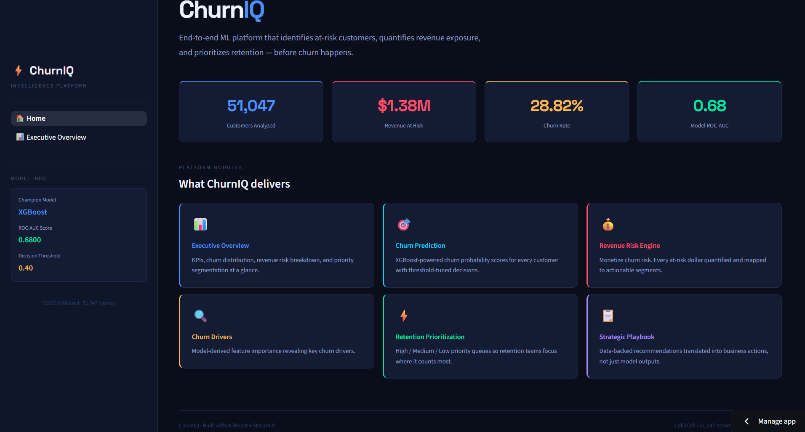
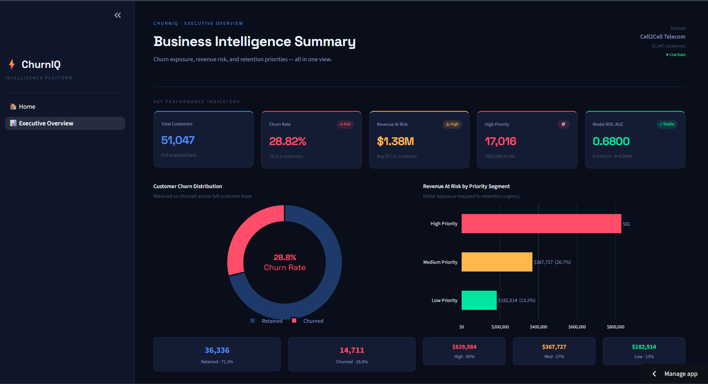
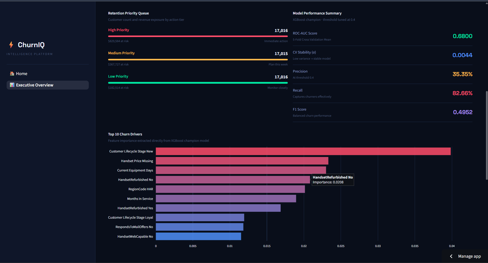
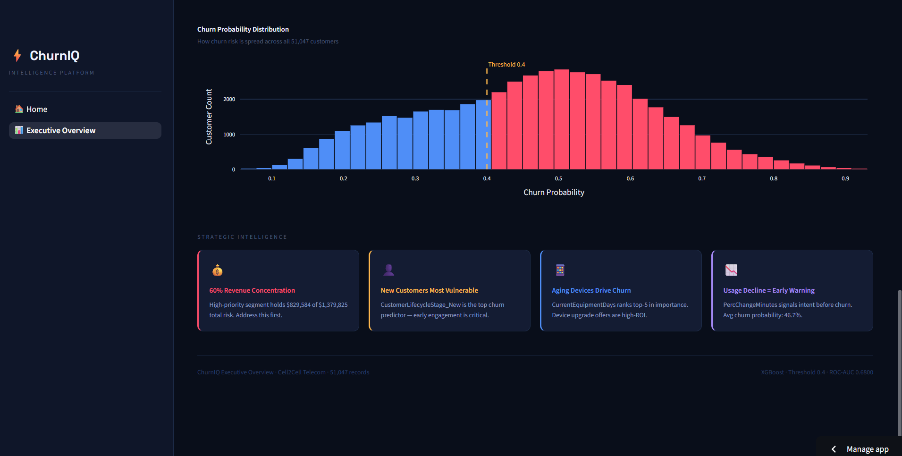

# ⚡ ChurnIQ

## Telecom Customer Churn & Revenue Risk Intelligence Platform

### Predict. Prioritize. Retain.

ChurnIQ is an end-to-end Machine Learning and Business Intelligence platform designed to help telecom companies proactively identify customers likely to churn, quantify potential revenue loss, and prioritize retention efforts before revenue leakage occurs.

The platform combines predictive analytics, revenue risk modeling, customer prioritization, and executive-level business intelligence into a single interactive Streamlit application.

---

## 🚀 Live Demo

**Streamlit Application**

https://churniq-telecom-churn-analyzer-izfkn7wga2thuzkjddtzon.streamlit.app/

**GitHub Repository**

https://github.com/akshitsharma009/churniq-telecom-churn-analyzer

---

## 🎯 Business Problem

Customer churn is one of the most significant challenges faced by telecom providers.

Most organizations discover churn after customers have already left, resulting in lost revenue, increased acquisition costs, and reduced customer lifetime value.

Traditional reporting answers:

* Who left?
* How many customers churned?

However, modern businesses need answers to:

* Which customers are likely to churn next?
* How much revenue is currently at risk?
* Which customers should retention teams prioritize?
* What factors are driving customer attrition?

ChurnIQ was built to answer these questions proactively.

---

## 💡 Solution Overview

ChurnIQ transforms raw telecom customer data into actionable retention intelligence through a complete machine learning pipeline.

The platform:

* Predicts customer churn probability using XGBoost
* Quantifies revenue exposure through a custom Revenue Risk Engine
* Segments customers into retention priority groups
* Identifies key churn drivers
* Generates executive-ready business insights
* Presents findings through an interactive Streamlit dashboard

The result is a business-focused intelligence platform rather than a simple churn prediction model.

---

# 🏗️ System Architecture

```text
Raw Telecom Data
        │
        ▼
Data Cleaning
        │
        ▼
Feature Engineering
        │
        ▼
Model Training
(XGBoost)
        │
        ▼
Churn Probability
Prediction
        │
        ▼
Revenue Risk Engine
        │
        ▼
Priority Segmentation
        │
        ▼
Executive Dashboard
(Streamlit)
```

---

# 📊 Dataset Information

### Dataset

Cell2Cell Telecom Customer Churn Dataset

### Records

51,047 Customers

### Target Variable

Churn

### Target Distribution

| Class |  Count |
| ----- | -----: |
| No    | 36,336 |
| Yes   | 14,711 |

### Actual Churn Rate

28.82%

---

# ⚙️ Technology Stack

## Programming

* Python

## Data Analysis

* Pandas
* NumPy

## Visualization

* Plotly

## Machine Learning

* Scikit-Learn
* XGBoost
* Imbalanced-Learn

## Dashboard

* Streamlit

## Model Persistence

* Joblib

## Configuration

* YAML
* Python Dotenv

---

# 🧹 Data Cleaning & Preprocessing

The raw telecom dataset underwent extensive cleaning and preprocessing before modeling.

### Key Steps

* Missing value treatment
* Data type corrections
* Category standardization
* Invalid value handling
* Duplicate checks
* Data consistency validation

Output:

```text
data/processed/train_clean.csv
```

---

# 🔧 Feature Engineering

Several business-oriented features were engineered to improve predictive performance and interpretability.

### Engineered Features

* CustomerValueProxy
* CreditRating_Encoded
* AgeHH2_Missing
* HandsetPrice_Missing
* RevenueGroup_Missing

### Features Removed

* CustomerID
* ServiceArea
* MarketCode
* AreaCode
* Original CreditRating

### Final Modeling Dataset

| Metric               |  Value |
| -------------------- | -----: |
| Records              | 51,047 |
| Features             |     58 |
| Numerical Features   |     38 |
| Categorical Features |     20 |

---

# 📈 Feature Selection Strategy

Two datasets were evaluated:

### Model A

Included retention-related variables:

* RetentionCalls
* RetentionOffersAccepted
* MadeCallToRetentionTeam

### Model B

Excluded retention variables.

### Final Choice

Model B

Reason:

Retention variables represent actions that occur after churn risk becomes apparent and may introduce target leakage.

Removing these variables improves real-world deployment reliability.

# 🤖 Machine Learning Pipeline

The objective of the machine learning layer is to accurately identify customers likely to churn while maintaining business usefulness and operational interpretability.

---

## Models Evaluated

Multiple machine learning algorithms were evaluated before selecting the final production model.

| Model                          | Accuracy | Precision | Recall | F1 Score | ROC-AUC |
| ------------------------------ | -------: | --------: | -----: | -------: | ------: |
| Logistic Regression            |   0.7118 |    0.4973 | 0.0313 |   0.0588 |  0.6083 |
| Logistic Regression (Balanced) |   0.5752 |    0.3552 | 0.5816 |   0.4410 |  0.6085 |
| Random Forest                  |   0.7166 |    0.5789 | 0.0598 |   0.1084 |  0.6591 |
| XGBoost                        |   0.6253 |    0.4030 | 0.6241 |   0.4897 |  0.6767 |

---

## 🏆 Champion Model

### XGBoost Classifier

XGBoost was selected as the final production model because it delivered the best balance between predictive power and business usefulness.

### Why XGBoost?

* Highest ROC-AUC Score
* Strong recall performance
* Better identification of churn-risk customers
* Stable cross-validation results
* Suitable for business-focused retention campaigns

The goal was not simply maximizing accuracy but maximizing the ability to identify customers likely to churn.

---

# 🎯 Threshold Optimization

Default classification thresholds often fail in churn prediction because churn is a business-risk problem rather than a pure classification problem.

Several thresholds were evaluated:

| Threshold |
| --------- |
| 0.50      |
| 0.40      |
| 0.35      |
| 0.30      |
| 0.25      |
| 0.20      |

### Selected Threshold

```text
0.40
```

### Final Metrics

| Metric    |  Value |
| --------- | -----: |
| Precision | 35.35% |
| Recall    | 82.66% |
| F1 Score  | 49.52% |
| ROC-AUC   | 0.6800 |

### Business Rationale

A lower threshold increases the number of customers flagged as at risk.

For retention teams, missing a potential churn customer is often more expensive than contacting an additional customer.

Therefore, recall was prioritized over accuracy.

---

# 📊 Cross Validation

To ensure model stability and generalization, 5-Fold Cross Validation was performed.

### Fold Scores

| Fold | ROC-AUC |
| ---- | ------: |
| 1    |  0.6800 |
| 2    |  0.6729 |
| 3    |  0.6856 |
| 4    |  0.6832 |
| 5    |  0.6784 |

### Results

| Metric             |  Value |
| ------------------ | -----: |
| Mean ROC-AUC       | 0.6800 |
| Standard Deviation | 0.0044 |

### Conclusion

The low standard deviation indicates that model performance remains stable across different data splits.

---

# 💰 Revenue Risk Engine

Traditional churn prediction answers:

> Which customers may leave?

ChurnIQ extends this concept further.

It also answers:

> How much revenue could be lost if they leave?

---

## Revenue Risk Formula

```text
Revenue Risk Score
=
Monthly Revenue × Churn Probability
```

### Example

Customer Monthly Revenue:

```text
$100
```

Predicted Churn Probability:

```text
0.80
```

Revenue Risk:

```text
$80
```

Interpretation:

The company is potentially exposed to an $80 revenue loss if the customer churns.

---

## Total Revenue Exposure

### Revenue At Risk

```text
$1,379,824.99
```

Approximately **$1.38 Million** of revenue was identified as being at risk.

---

# 🚨 Customer Prioritization Framework

To support retention operations, customers were segmented into priority groups.

### Priority Levels

| Segment |
| ------- |
| High    |
| Medium  |
| Low     |

### Distribution

| Segment | Customers |
| ------- | --------: |
| High    |    17,016 |
| Medium  |    17,015 |
| Low     |    17,016 |

This prioritization enables retention teams to focus efforts where business impact is highest.

---

# 📈 Key Churn Drivers

Feature importance analysis revealed the most influential churn indicators.

### Top Drivers

* CustomerLifecycleStage_New
* CurrentEquipmentDays
* HandsetPrice_Missing
* MonthsInService
* CustomerValueProxy
* PercChangeMinutes
* MonthlyMinutes

These features provide actionable insights into customer behavior and retention risk.

---

# 🧠 Business Insights

The analysis revealed several meaningful business patterns.

### Insight 1

New customers are significantly more likely to churn.

### Insight 2

Customers using aging devices show increased churn propensity.

### Insight 3

Declining usage patterns often act as early churn signals.

### Insight 4

Customer value strongly influences retention priority.

### Insight 5

A large proportion of total revenue exposure is concentrated among high-risk customers.

These findings can be directly translated into retention campaigns and business strategies.

---

# 📊 Dashboard Overview

ChurnIQ includes an interactive executive dashboard built using Streamlit.

### Home Page

Provides a high-level overview of the platform and key business metrics.

### Executive Overview

Includes:

* Customer KPIs
* Churn Rate
* Revenue At Risk
* Priority Segmentation
* Churn Distribution
* Revenue Risk Analysis
* Churn Drivers
* Strategic Intelligence Insights

The dashboard automatically loads data from model outputs and processed datasets, enabling dynamic updates whenever underlying data changes.

# 🖼️ Dashboard Preview

## Home Page



---

## Executive Overview



---

## Top Churn Drivers



---

## Churn Probability Distribution



---

# 📊 Results & Business Impact

The final solution successfully combines predictive analytics with business intelligence.

### Final Results

| Metric             |  Value |
| ------------------ | -----: |
| Customers Analyzed | 51,047 |
| Actual Churn Rate  | 28.82% |
| ROC-AUC Score      | 0.6800 |
| Precision          | 35.35% |
| Recall             | 82.66% |
| F1 Score           | 49.52% |
| Revenue At Risk    | $1.38M |

---

## Business Impact

ChurnIQ enables organizations to:

* Identify customers likely to churn
* Quantify potential revenue loss
* Prioritize retention campaigns
* Understand churn drivers
* Allocate retention budgets efficiently
* Improve customer lifetime value

The platform converts machine learning predictions into actionable business decisions.

---

# 📂 Project Structure

```text
churniq/
│
├── app/
│   ├── app.py
│   └── pages/
│       └── 1_Executive_Overview.py
│
├── data/
│   ├── raw/
│   └── processed/
│       ├── train_clean.csv
│       ├── feature_engineered.csv
│       └── revenue_risk_output.csv
│
├── models/
│   ├── champion_xgboost.joblib
│   └── model_metrics.json
│
├── notebooks/
│   ├── 01_data_exploration.ipynb
│   ├── 02_data_quality_assessment.ipynb
│   ├── 03_data_cleaning_strategy.ipynb
│   ├── 04_data_cleaning_preprocessing.ipynb
│   ├── 05_feature_engineering.ipynb
│   ├── 06_modeling_preparation.ipynb
│   ├── 07_baseline_modeling.ipynb
│   ├── 08_random_forest_modeling.ipynb
│   ├── 09_xgboost_modeling.ipynb
│   ├── 10_model_validation.ipynb
│   ├── 11_business_insights.ipynb
│   └── 12_revenue_risk_engine.ipynb
│
├── reports/
│   └── figures/
│
├── config/
│   └── config.yaml
│
├── requirements.txt
└── README.md
```

---

# ⚙️ Installation

## Clone Repository

```bash
git clone https://github.com/akshitsharma009/churniq-telecom-churn-analyzer.git
cd churniq-telecom-churn-analyzer
```

## Create Environment

```bash
conda create -n churniq python=3.10
conda activate churniq
```

## Install Dependencies

```bash
pip install -r requirements.txt
```

---

# ▶️ Run Application

```bash
streamlit run app/app.py
```

Application will be available at:

```text
http://localhost:8501
```

---

# ☁️ Deployment

The project is deployed using Streamlit Community Cloud.

### Live Application

https://churniq-telecom-churn-analyzer-izfkn7wga2thuzkjddtzon.streamlit.app/

---

# 🔮 Future Enhancements

Potential future improvements include:

### Machine Learning

* Hyperparameter Optimization
* Model Monitoring
* Drift Detection
* Automated Retraining Pipelines

### Explainability

* SHAP Integration
* Customer-Level Explanations

### Product Features

* Customer Churn Prediction Page
* Revenue Risk Explorer
* Retention Recommendation Engine
* Executive PDF Reporting

### Engineering

* REST API Deployment
* Docker Containerization
* CI/CD Pipelines
* Cloud Infrastructure Deployment

---

# 🎓 Learning Outcomes

This project demonstrates practical experience in:

* Data Cleaning
* Feature Engineering
* Predictive Modeling
* XGBoost
* Model Validation
* Business Analytics
* Revenue Risk Modeling
* Dashboard Development
* Streamlit Deployment
* End-to-End Machine Learning Systems

---

# 👨‍💻 Author

**Akshit Sharma**

B.Tech (CSE - AI Specialization)

Aspiring AI/ML Engineer | Data Scientist

### Connect

* GitHub: https://github.com/akshitsharma009
* LinkedIn: Add Your LinkedIn Profile

---

# ⭐ If you found this project interesting

Consider giving the repository a star.

It helps support future open-source and data science projects.

---

## ChurnIQ

**Predict. Prioritize. Retain.**
